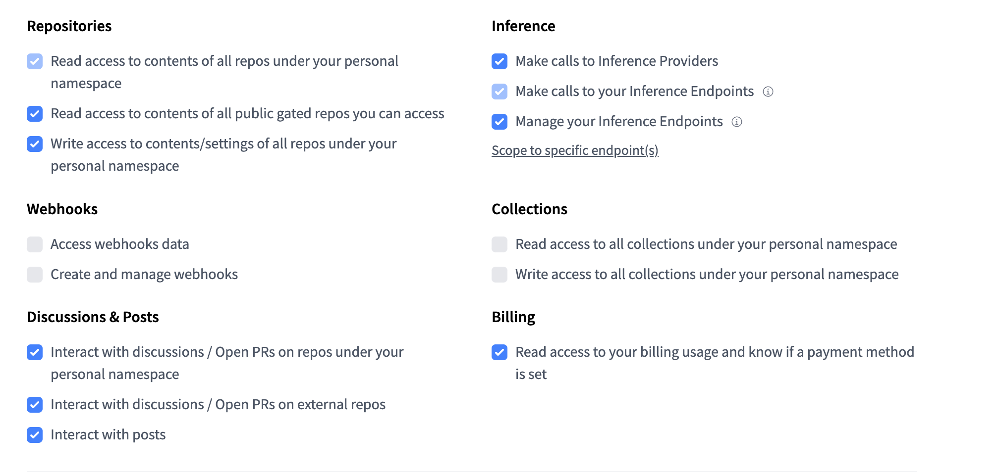
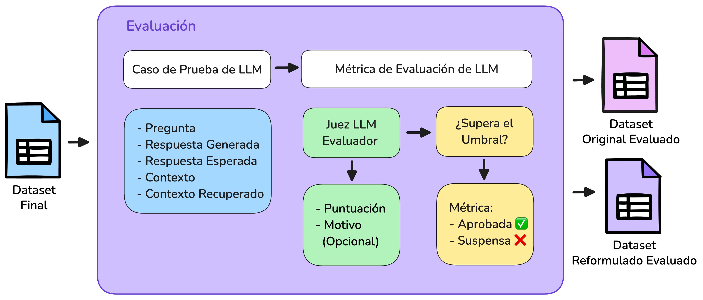

# 🚀 RAG QA Generator

Proyecto para generar preguntas sobre documentos utilizando **RAGs** (Retrieval-Augmented Generation) con **DeepEval** y modelos locales.

## 📝 Descripción del Proyecto
 
Este proyecto facilita la generación automática de preguntas a partir de un conjunto de documentos, implementando un flujo de **Recuperación** (Retrieval) y **Generación** (Generation) basado en modelos de lenguaje local. Se integra con DeepEval para evaluar la calidad de las preguntas generadas y permite la configuración de servidores locales de modelos (VLLM y Ollama).


---

## 💻 Requisitos Previos ✅

- Python 3.11 🐍
- pip 📦 
- Git 🐧
- Hardware compatible con VLLM y Ollama 💻

---

## 🛠️ Instalación 🔧

### 1. Crear un entorno virtual 🎯

```bash
python3 -m venv venv
source venv/bin/activate
```

### 2. Instalar dependencias base 📥

```bash
pip install -r requirements.txt
```

### 3. Configurar Hugging Face 🤗

Primero, instala y configura el CLI de Hugging Face:

```bash
huggingface-cli login
```

**Configuración del token de Hugging Face:**
- Ve a https://huggingface.co/settings/tokens
- Crea un nuevo token con permisos de lectura 🔑
- Usa la configuración mostrada en la imagen 📸

- Introduce el token cuando se te solicite ✍️

### 4. Instalar y configurar DeepEval 🧠

```bash
pip install -U deepeval
deepeval login --confident-api-key [TU-API-KEY-DE-DEEPEVAL]
```

**Obtener API key de DeepEval:**
- Regístrate en https://deepeval.com/ 📝
- Sigue las instrucciones en: https://deepeval.com/docs/getting-started
- DeepEval es gratuito y con su api-key permite mantener todos los resultados de evaluación en la nube ☁️

### 5. Aplicar modificaciones personalizadas 💡

**Importante:** Reemplaza los archivos modificados de la carpeta `codigo_modificado/` en tu instalación local de la librería de DeepEval. 🔄

---

## ⚙️ Configuración de Servidores 🖥️

### Servidor VLLM (Terminal 1) 🎛️

```bash
vllm serve meta-llama/Meta-Llama-3-8B-Instruct \
    --port 8000 \
    --dtype float16 \
    --max-model-len 4096 \
    --tool-call-parser llama3_json
```

### Servidor Ollama (Terminal 2) 🖥️

**Instalación de Ollama (Ubuntu/Debian):**

```bash
# Actualizar sistema
sudo apt update 
sudo apt install curl -y

# Herramientas para detección de hardware
sudo apt install pciutils lshw -y 

# Instalar Ollama
curl -fsSL https://ollama.com/install.sh | sh
```

**Ejecutar servidor Ollama:**

```bash
ollama serve
```

### Descargar modelos necesarios (Terminal 3) 📦

```bash
# Modelo de razonamiento
ollama pull deepseek-r1:1.5b

# Modelo de embeddings en español
ollama pull jina/jina-embeddings-v2-base-es
```

### 🔧 Configurar DeepEval con modelos locales 🛠️

```bash
# Configurar modelo principal
deepeval set-local-model \
  --model-name="meta-llama/Meta-Llama-3-8B-Instruct" \
  --base-url="http://localhost:8000/v1/" \
  --api-key="not-needed"

# Configurar embeddings
deepeval set-ollama-embeddings deepseek-r1:1.5b \
  --base-url="http://localhost:11434"
```

---

## 🚀 Uso ▶️

### Configuración inicial 🔧

Edita `main.py` para especificar:
- Ruta de documentos de entrada 📂
- Ruta de salida (por defecto: `output/`) 📤

### Ejecutar el generador ▶️

```bash
python3 main.py
```

### Opciones de ejecución ⚙️

Puedes saltar pasos específicos usando flags:

```bash
python3 main.py --skip_step1 --skip_step2 --skip_step3
```

- `--skip_step1`: Saltar generación ⏭️
- `--skip_step2`: Saltar reformulación ⏭️
- `--skip_step3`: Saltar módulo RAG ⏭️

### Resultados 📊

- Los resultados incrementales se guardan en la carpeta `output/` 📁
- El dataset final incluye preguntas generadas y sus respuestas correspondientes 📚

---

## 📈 Evaluación 📝



Una vez generado el dataset, puedes evaluarlo ejecutando:

```bash
python3 mod_4_evaluar.py
```
Este script realizará la evaluación automática del dataset final. 